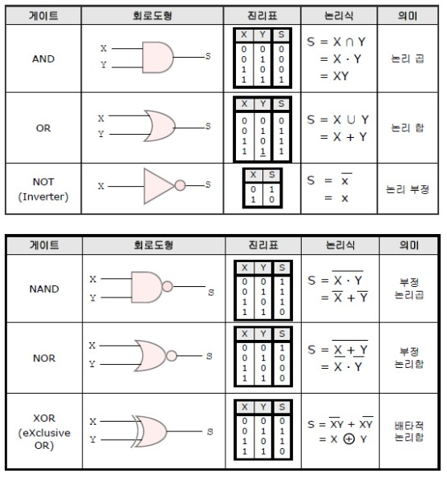
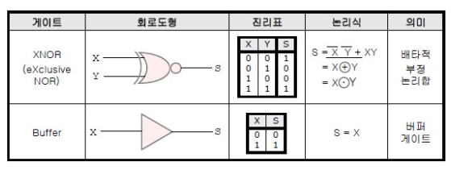

###  논리회로의 기본
#### 불대수
##### 자주 까먹는것 기본정리

<table>
  <tbody>
    <tr>
      <td> 분배법칙</td>
      <td>A+(B+C) = (A*B)+(A*C)</td>
      <td>A+B*C = (A+B)*(A+C)</td>
    </tr>
    <tr>
      <td>결합 법칙</td>
      <td>A+(B+C) = (A+B)+C </td>
      <td>A*(B*C) = (A*B)*C </td>
    </tr>
    <tr>
      <td>유일의 법칙</td>
      <td colspan="2">
          1. A+A = A 
          2. A*A = A 
          3. A*0 = 0 
          4. A+A = A 
          5. A+1 = 1 
          6. A*1 = A 
      </td>
    </tr>
    <tr>
      <td>흡수의 법칙</td>
      <td colspan="2">
          1.A+A*B = A 
          2.A*(A+B) = A 
      </td>
    </tr>
    <tr>
      <td>보수의 법칙</td>
      <td colspan="2">
          1.A+A' = 1 
          2.A*A' = 0 
      </td>
    </tr>
    <tr>
      <td>드모르간의 정리</td>
      <td colspan="2">
          1.(A+B)' = A'*B' 
          2.(A*B)' = A'+B' 
      </td>
    </tr>
  </tbody>
</table>

##### 논리게이트

* AND OR NOT
 >
* NAND, NOR,XOR
 >
* XNOR, Buffer
 >

[출처_영진전문대학컴퓨터정보계열]

